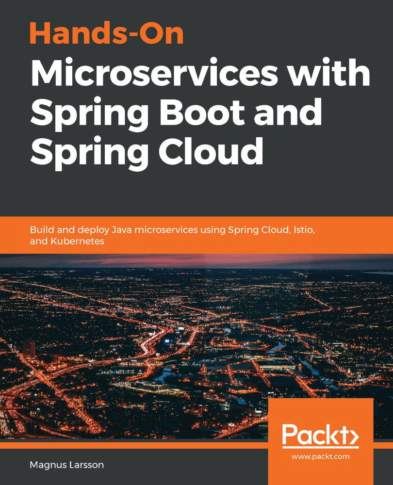

# 스프링으로 하는 마이크로서비스 구축

> 원제 : Hands-On Microservices with Spring Boot and Spring-Cloud

 

### 스터디원

- 권민준 (@MinJunKweon)
- 양희찬 (@log-info)
- 이도현 (@2rohyun)
- 조민국 (@minkukjo)

### 스터디 방식

- 매주 한 챕터씩 Issue를 생성해서 각자 중요한 내용을 정리해서 코멘트를 남깁니다.
  - 코멘트 내용은 중요한 부분을 정리한 것이나, 질문, 추가로 알면 좋은 내용들을 남깁니다.
- 매주 금요일 21시 30분마다 온라인으로 간단하게 미팅을 진행합니다.
  - 플랫폼 : Google Meet
- 스터디원 순번을 정해서 라운드로빈으로 1개 챕터씩 오너십을 갖습니다.
  1. 도현
  2. 민국
  3. 민준
  4. 희찬
- 오너십을 가진 스터디원은 그 주 미팅에서 나온 내용을 정리해서 레포에 올리는 역할을 합니다.

### Reference

- 도서정보 - [에이콘출판사 도서정보 페이지](http://www.acornpub.co.kr/book/microservices-spring)
- 예제 코드 - [PacktPublishing Repo](https://github.com/PacktPublishing/Hands-On-Microservices-with-Spring-Boot-and-Spring-Cloud), [에이콘 출판사 Repo](https://github.com/AcornPublishing/microservices-spring)
- 실습 동영상 - [Youtube](https://www.youtube.com/playlist?list=PLeLcvrwLe185prGhjUrFGQsOh_0MArR1P)
- [책에서 사용된 Color 이미지 pdf](http://www.acornpub.co.kr/acorn_guest/9781789613476_ColorImages.pdf)